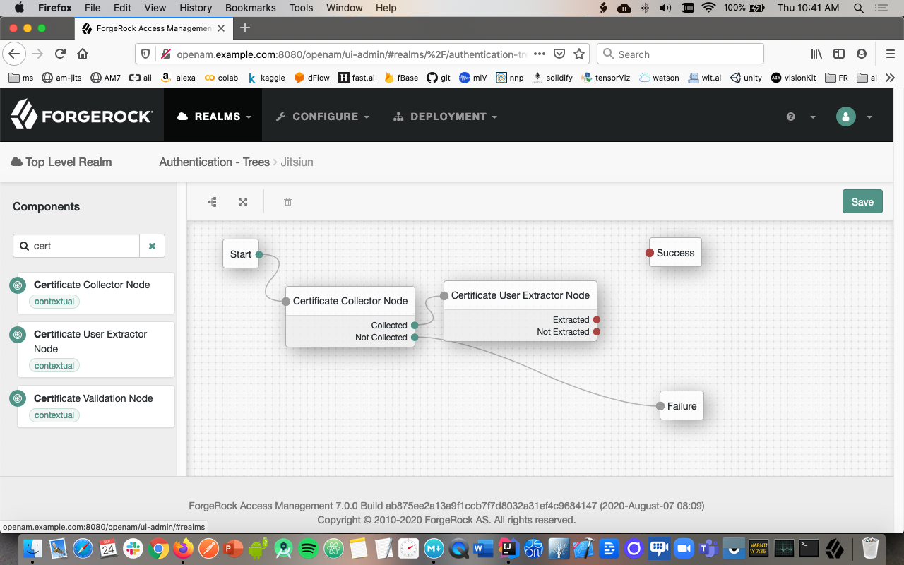
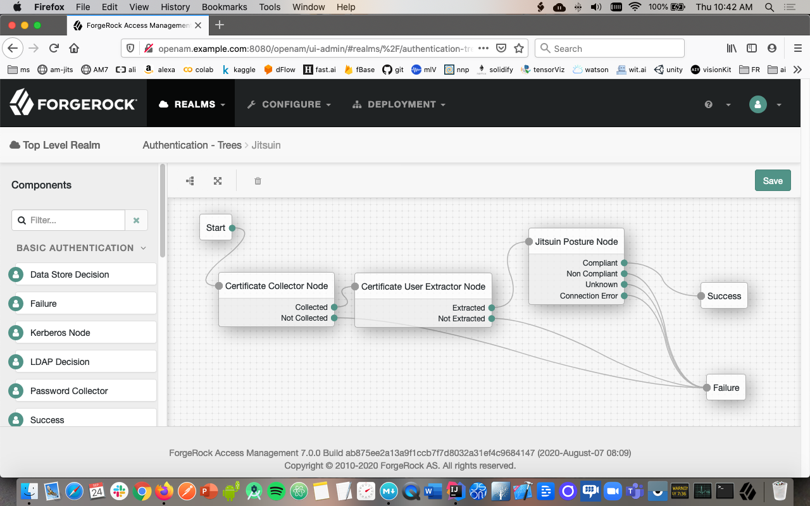
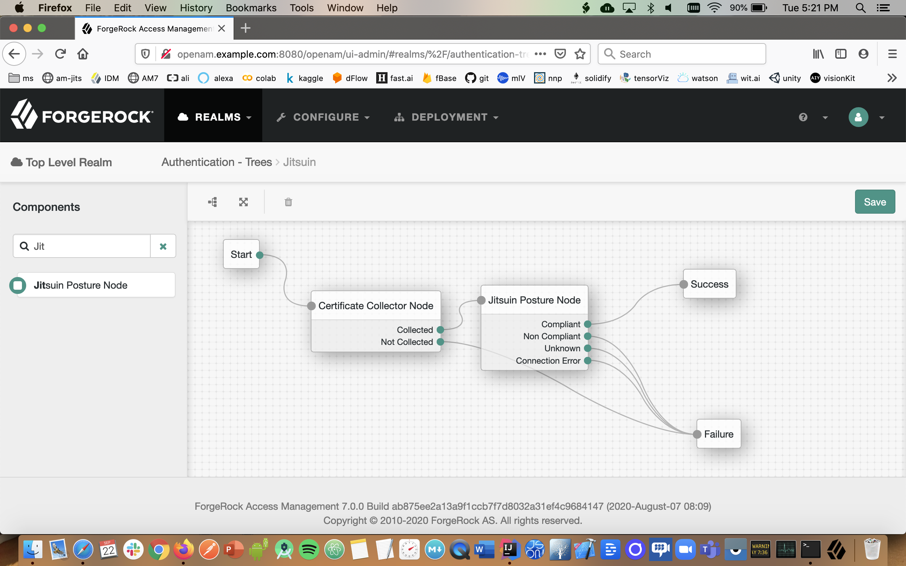

# Thing Posture

This ForgeRock Authentication Tree queries a Jitsuin Archivist system to see whether or not a Thing satisfies a Compliance Policy (ie, checks it's "Thing Posture") before it is allowed to access a protected resource.

A unique identifier is needed for said query; one option is to distribute x509 "mutual certificates" to each Thing enrolled with the Thing's unique identifier (populated in the 'CN' field of the x509 certificate). Then an authentication tree can be configured to extract the Thing's unique identifier from the CN field in the presented certificate; with that in hand, the authentication tree makes a ReST query to Jitsuin for Thing Posture information.

The Jitsuin Authentication Node can return 1 of 3 results:

1. the Thing is unknown to Jitsuin
2. the Thing is known to Jitsuin but fails to pass their Compliance checklist (ie, OS is not up to date, patch has not been applied within a valid time period, etc)
3. the Thing is known and it passes their Compliance checklist

Only in event #3 is returned does the authentication tree carry on; if #2 is returned an additional step-up challenge could optionally be issued; if #1 is returned tree exits altogether. 

### Configuration: Jitsuin

The details for configuring Jitsuin are [here](https://jitsuin-archivist.readthedocs.io/en/latest/).

### Configuration: Mutual TLS

The details for configuring Jitsuin are [here](./config/mtls.md).

### Configuration: ForgeRock Authentication Node

Once the above has been done and verified, configure an Authentication Tree as follows:

1. Download the Auth Node the Jitsuin*.jar from the below ../target directory into the ../web-container/webapps/openam/WEB-INF/lib directory where AM is deployed.
2. Restart the web container to pick up the new nodes.  The new node will then appear in the authentication trees components palette.
3. Create a new Authentication Tree 
4. If you are running Access Manager 7 or later drop in the Certificate Collector Node and configure it (if you are running AM 6.x, use the Certificate Reader from  
5.    (https://github.com/javaservlets/CertificateReader) 
5. From the components pallete select the Jitsuin node and configure it this manner: 
6. From the components pallete select the Success node and configure it this manner: 
7. For the case where Jitsuin returns a 'non-compliant' status, it is up to you to decide if you want to perform an additional step-up challenge, display a message, redirect, account lockout, etc.
8. Click on the Jitsuin node and enter your account-specific values for Jitsuin 

-

The sample code described herein is provided on an "as is" basis, without warranty of any kind, to the fullest extent permitted by law. ForgeRock does not warrant or guarantee the individual success developers may have in implementing the sample code on their development platforms or in production configurations.

ForgeRock does not warrant, guarantee or make any representations regarding the use, results of use, accuracy, timeliness or completeness of any data or information relating to the sample code. ForgeRock disclaims all warranties, expressed or implied, and in particular, disclaims all warranties of merchantability, and warranties related to the code, or any service or software related thereto.

ForgeRock shall not be liable for any direct, indirect or consequential damages or costs of any type arising out of any action taken by you or others related to the sample code.

[forgerock_platform]: https://www.forgerock.com/platform/  
