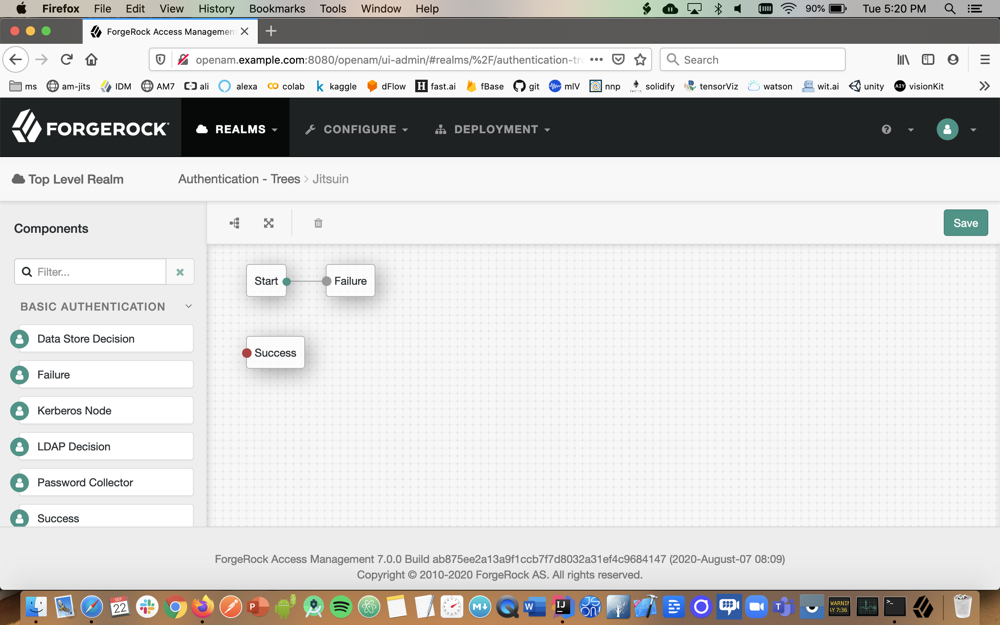

# Device Posture - Jitsuin

This ForgeRock Authentication Tree queries a Unified Endpoint Management (UEM) system to see whether or not the end-user's device satisfies a Compliance Policy (ie, checks it's "Device Posture") before it is allowed to access a protected resource.

A unique identifier is needed for said query, thus you need to leverage the UEM's capability to issue and distribute x509 "mutual certificates" (also known as "browser" or "client" certificates) to each device it enrolls, with the device's unique identifier (populated in the 'CN' field of the x509 certificate).

Since you will also configure Mutual Transport Layer Security (mTLS) on the server running ForgeRock Open Access Manager, each time a device interfaces with ForgeRock, it is requested *and required* to present it's client certificate. 

The authentication tree below is configured to extract the device's unique identifier from the CN field in the presented certificate; with that in hand, the authentication tree next makes a ReST query to the UEM for Device Posture information.

The UEM can return 1 of 3 results:

1. the device is unknown to the UEM
2. the device is known to the UEM but fails to pass their Compliance checklist (ie, OS is not up to date, phone is jailbroken, PIN has not been set, etc)
3. the device is known and it passes their Compliance checklist

Only in event #3 is returned does the authentication tree carry on; if #2 is returned an additional step-up challenge could optionally be issued; if #1 is returned tree exits altogether. 

### Configuration: Jitsuin

<<<<<<< HEAD
The details for configuring Jistuin are [here](https://jitsuin.com).
=======
The details for configuring MobileIron are [here](https://marketplace.mobileiron.com/servlet/servlet.FileDownload?file=00P2T00001N4HCvUAN).
>>>>>>> 41770affb187934bd2214365bc5c0a6cd1f875e6

### Configuration: mTLS

The details for configuring Mutual Authentication are [here](./config/Jitsuin.md).

### Configuration: ForgeRock Authentication Node

Once the above has been done and verified, configure an Authentication Tree as follows:

1. Download the Auth Node that extracts the unique identifier from the x509 from https://github.com/javaservlets/CertificateReader
2. Copy that CertificateReader.jar *plus* the Jitsuin*.jar from the below ../target directory into the ../web-container/webapps/openam/WEB-INF/lib directory where AM is deployed.
3. Restart the web container to pick up the new nodes.  The two nodes will then appear in the authentication trees components palette.
4. From the components pallete select the Certificate Reader node and configure it this manner: 
5. From the components pallete select the Jitsuin node and configure it this manner: 
6. From the components pallete select the Success node and configure it this manner: 
7. For the case where the UEM returns a 'non-compliant' status, it is up to you to decide if you want to perform an additional step-up challenge, display a message, redirect, account lockout, etc.
8. Click on the Jitsuin node and enter your account-specific values for Jitsuin Endpoint, Admin Username, Admin Password

-

The sample code described herein is provided on an "as is" basis, without warranty of any kind, to the fullest extent permitted by law. ForgeRock does not warrant or guarantee the individual success developers may have in implementing the sample code on their development platforms or in production configurations.

ForgeRock does not warrant, guarantee or make any representations regarding the use, results of use, accuracy, timeliness or completeness of any data or information relating to the sample code. ForgeRock disclaims all warranties, expressed or implied, and in particular, disclaims all warranties of merchantability, and warranties related to the code, or any service or software related thereto.

ForgeRock shall not be liable for any direct, indirect or consequential damages or costs of any type arising out of any action taken by you or others related to the sample code.

[forgerock_platform]: https://www.forgerock.com/platform/  
